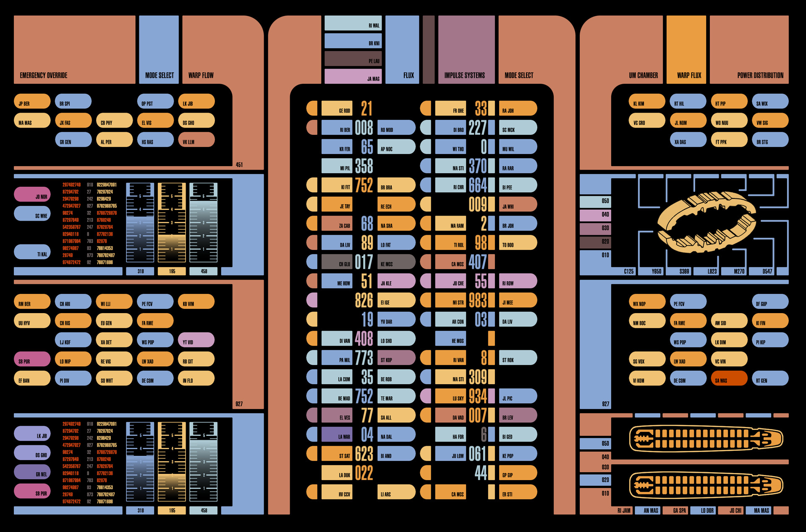

# LCARS Style Notes

Analysis of the reference images, cataloging the style conventions that
define the LCARS (Star Trek) look.

> **There is a skill for this.** `.claude/skills/lcars-design/SKILL.md` is
> the procedure - what to read, in what order, how to crop the images, how to
> verify geometry, and the checklist of rules most often got wrong. It is
> deliberately thin and points back here. **This document is the source of
> truth; the skill is the trigger.** When a rule changes, change it here, and
> only touch the skill if the *procedure* changed.

## The reference images

**Look at them before designing or changing any UI in this project** - they
are the thing every rule below was read off, and the rules are a summary,
not a replacement. All three live in `docs/reference/`, so the analysis and
its sources travel together.

| file | what it is best for |
| --- | --- |
| `LCARS-2.jpg` (1920x1271) | data rows, gauges, the dense-directory feel |
| `Lcars menu.webp` (1024x1024) | titles, sweeps that turn into button runs, lists with lamps |
| `lcars-ultra-220809.png` (3786x2022) | a whole page: rails, brackets, grids, framed content |

The two newer ones were added 2026-08-06 and are read in **More options,
from the second and third references** below. That section is additive - it
does not overturn anything here, but it does answer questions this one was
too small a sample to answer, and it is where to look first for a *layout*
rather than a control.

There is also a **fourth source that is not an image**: `thelcars.com`, a
working HTML/CSS template, reviewed 2026-08-11 and written up in **A live
source** below. It is measurable rather than merely viewable, which is why
it can settle questions the stills cannot - but it is fan-made, so **where
it disagrees with the images, the images win.**

`.webp` reads directly, no conversion needed. For crops, `ffmpeg -i in -vf
"crop=w:h:x:y,scale=iw*3:ih*3:flags=neighbor" out.png` - nearest-neighbour,
so the corner radii stay crisp enough to measure.

### The first reference



It lived outside the repo until 2026-08-02, which is why these notes cited
a filename that resolved to nothing. Now committed.

A few specifics from it that the summary below is too general to carry:

- **Section titles sit at the bottom-left of their colour block**, not
  centred and not at the top - the block is a shelf the label rests on.
- **Numbers keep their leading zeros**: `008`, `017`, `007`, `061`, `03`.
  Fixed-width readouts, never trimmed, which is what makes a column of them
  scan as instrument output rather than as text.
- **A data row reads index tab, label pill, big number, label pill.** The
  number is the anchor and is roughly twice the label's size; the small
  stub tab that opens each row is colour-coded and carries no text.
- **The same colour repeats freely down a column.** Grouping is the job
  colour is doing, so repetition is the signal, not a collision to avoid.

## Structure & Shape

- **Elbow/bracket macro-shapes** — the defining LCARS move: a block starts as a sharp rectangle and sweeps into a fully rounded end where it meets the panel's outer edge. Interior joints between adjacent segments stay flat/square — rounding is reserved for exposed outer edges only.
  - Said the other way round, because the intuition runs backwards: **rounded is where a run *terminates*, flat is where it *continues*.** The centre columns are the clearest case — each data row opens with a narrow stub, carries labels flat at both ends through the middle, and stops with a label rounded where the row ends.
  - **Corrected 2026-08-06 by cropping the image**: this bullet used to say the opening stub was rounded on its *outer* end. It is the other way round — the stub is flat on the side facing the block's edge and rounded on the side facing the row, and so is every closing pill, mirrored. Flat toward the frame, rounded toward the content, which is independently where the phone bars ended up. `LcarsKitPrototype`'s "Data rows" section is the measured reproduction.
  - **A flat edge does not have to touch its neighbour.** Flat ends face each other across a black gap all through the image; the grout is separation, not a break in the run. What a flat edge does require is that the neighbour be *visible* — a cut against something you cannot see reads as an amputation rather than as a joint. That is the trap `MobileJumpBar` fell into on its first build (see `mobile-layout-plan.md`).
  - **The screen edge is a legitimate thing to continue into**, and the strongest one available: a run that ends flat *on the glass* reads as carrying on off-frame. It only works if it genuinely reaches the edge, so the two phone bars (`MobilePanelBar`, `MobileJumpBar`) cancel the shell's gutter on that one side with `-mr-3 md:-mr-6`. They are the only places in the app allowed to break the 12px frame.
  - **A cap belongs to a short segment. A tall block is square.** Added
    2026-08-07 after the nav rail's filler shipped as a 500px-tall
    `rounded-l-full` and rendered as an enormous lozenge. `rounded-*-full`
    is a half-circle of *half the box's height*, so the same class that
    makes a 40px button an LCARS pill makes a 500px block a shape no
    console has ever contained. The references separate the two cleanly:
    in `lcars-ultra`'s rails the big unlabelled masses (497px, 687px) have
    no rounding at all, while the 40-150px labelled cells beside them are
    capped. If a segment is taller than it is wide, it is a vertical run,
    and a vertical run never ends in a cap.
  - **Moving a cap is a flip, not a cut.** When a segment turns to face the other way, its rounded end changes sides; it does not simply vanish, leaving both ends square. Both phone bars ended up with every segment rounded on its inner side and flat on the side facing the glass.
- **Jigsaw/asymmetric grid** — blocks are not a uniform grid. Widths and heights vary block to block, tiled together with no visible seams other than thin black gaps. Nothing is centered or symmetric as a whole composition.
- **Black as structural material** — pure black isn't just a background, it's the "grout" between every block. No borders/strokes are ever drawn; separation is done entirely by black gaps and touching color blocks.
- **Nested sub-panels** — smaller bordered black rounded-rect containers sit inside the larger overall composition, implying hierarchy/grouping.

## Color

- Muted, desaturated palette — terracotta/salmon, tan-orange, powder blue, dusty mauve, ice blue, blue-gray, occasional pink — nothing fully saturated or glossy. Retro-futuristic rather than "sci-fi neon."
- **Red is scarce and deliberate** — reserved for alert/critical status rather than decoration; appears only once in the first reference image. Refined by the third: a *desaturated* brick red is structural there and used heavily, while the saturated red stays scarce. See **The palettes, sampled** below.
- Color appears to encode category/grouping (system type) rather than being random per-button.

## Typography

- Condensed, all-caps, geometric sans-serif (Swiss/Helvetica-Condensed family) used throughout — no serif or decorative fonts.
- Labels are terse alphanumeric codes (two-to-three-letter fragments) rather than descriptive English — reinforces a "dense technical directory" feel over a consumer UI feel.
- Large embedded numeric readouts sit directly inside rows next to labels, at noticeably larger scale/weight than the label text — numbers are treated as primary content, not just decoration.
- Text/numbers hug one edge of their pill (flush against the rounded cap) rather than being centered — creates directional reading flow along a row.

## Flat Rendering

- Zero gradients, shadows, bevels, or glow — everything is flat, opaque color fill. Depth is implied only by layering/overlap, never by lighting.

## Recurring Motifs

- Vertical "gauge" bars with tick-mark scales — an analog-instrument metaphor rendered in flat vector style.
- Thin outline ship/technical schematics rendered in a single accent color as line art, used as functional-looking decoration within an otherwise abstract panel.
- Stacked short color pills along edges acting as index/legend strips, distinct from the interactive-looking buttons.

## More options, from the second and third references

Added 2026-08-06. `Lcars menu.webp` is a single dense panel ("FOOD SERVICE");
`lcars-ultra-220809.png` is a full page template. Everything below was read
off nearest-neighbour crops rather than remembered, and where a claim is
about colour it was sampled rather than eyeballed.

Three things they carry that `LCARS-2.jpg` does not: a **title treatment**,
a **sweep that turns into a row of buttons**, and enough vertical runs to
say what one actually looks like.

### The title is a block, a name, and a shelf

`FOOD SERVICE` at the top left, and it is three separate objects on one
line, not a heading in a bar:

1. A **solid rectangle, square on all four corners**, about as tall as the
   title's cap height and rather wider. It carries no text. It is a full
   stop in reverse - it starts the line.
2. The **title itself, set on black**, in the light lilac, at maybe four
   times the body size. Nothing behind it. This is the only place in either
   image where large text sits on bare black rather than on a colour.
3. Immediately to its right, with no gap, the **head of the top-right sweep**
   - a big orange mass whose left edge is flat and butts against the end of
   the title's last letter. The title looks like it is resting against the
   frame, or holding it back.

Inside that mass, bottom-aligned and small, sits a **subordinate label in
dark text on the colour**: `REPLICATOR`. So the pair inverts twice over -
the title is large, light, on black; its qualifier is small, dark, on
colour. Two levels of heading and only one line of vertical space spent.

`lcars-ultra` does titles differently and both are worth having: big
condensed caps, right-aligned against the frame, on black, using **` • ` as
the separator** rather than punctuation - `LCARS • ONLINE`, `WELCOME TO
LCARS ULTRA • CLASSIC THEME`. The bullet is doing the work a colon or a dash
would do in ordinary type, and it is the one non-alphanumeric mark either
image uses.

### The sweeping border that becomes a row of buttons

This is the move worth stealing, and it appears in both images.

A thick vertical trunk sweeps around a large-radius corner into a
**horizontal arm that is much thinner than the trunk** - a taper, not a
constant-width elbow. The arm runs out flat, and then, after a hairline of
black, **it keeps going as a row of segments in different colours**: same
height as the arm, flat at both ends, irregular widths, hairline gaps.

```
   ####\
   #####\____________________  __ _______ ____________ ___
   ######                     |  |       |            |   |
   ######    <- trunk           ^ arm continues as a run of cells
```

In `lcars-ultra` two of these stack, blue above red, and their segment
breaks do **not** line up between the rows - each row keeps its own rhythm.
In `Lcars menu` the same thing happens vertically: the sweep comes down and
the descending trunk is subdivided into stacked coloured cells, one of which
carries a label (`203 UT5`) and is therefore a button.

What this buys is the thing our layout keeps paying for separately: the
frame and the controls are the same object. There is no "nav area" with a
border round it - the border *is* the nav, and where it has nothing to do it
is just filler cells. It also means a run can change thickness mid-course
without breaking, which the flat-continues rule already permits but nothing
in the app currently uses.

### Vertical runs, and why theirs look better than ours

Both images use vertical runs heavily, and they are built quite differently
from `NavRail`. The differences, in rough order of how much they matter:

- **A vertical run never terminates in a rounded cap.** Checked at every
  column end in both images: a vertical column either stops **flat** (it runs
  off the frame, or hands over to the next block) or it **turns a corner**
  into a horizontal arm. The half-circle cap is a *horizontal* mark. This is
  the sharpest new rule here, and `LcarsKitPrototype`'s "Vertical run"
  specimen - caps top and bottom, made by rotating the horizontal grammar 90
  degrees - is a shape neither reference contains.
- **Cell heights vary enormously within one run.** `lcars-ultra`'s left-hand
  column runs one huge cell, then three shallow ones, then another huge one.
  Ours are all one height, which is what makes them read as a list of
  buttons rather than as a panel that has buttons in it.
- **The label sits in the bottom-right corner of its cell**, small, dark, with
  the rest of the cell left as empty colour - `AA-1524`, `ONE`, `TWO`,
  `03-111968`. Ours are `justify-center`. Centring is the single most
  un-LCARS thing about our buttons, and the old "text hugs one edge" bullet
  under **Typography** already said so without ever being applied to a
  control.
- **Colour varies cell to cell** down the run - red, peach, salmon, lilac,
  blue - rather than one colour per destination-with-meaning. Grouping is
  still colour's job elsewhere, but a *rail* is treated as decoration that
  happens to be clickable, so it is free to be a stripe of colours.
- **Edge-anchored, hairline gaps.** The run is flush to the frame with no
  outer margin, and the black between cells is a hairline rather than the
  4px we use.

Where ours does match: a **column of horizontal pills, each capped on the
same outer side and flat toward the content**, is exactly the Food Service
left column (`39451`, `6 7860`, `203 H74`, ...) and the `lcars-ultra`
left-hand grid. The cap side is uniform for the whole column - it is not
computed per position. `NavRail` is right about that, and the kit specimen
is describing a different shape than the one `NavRail` builds.

### Grids of flat cells

`lcars-ultra`'s left blocks are two columns by three rows; `Lcars menu`'s
foot is seven by three. Both are directories, not runs, and the grammar is:

- **Every interior corner is square.** No cell is capped against its
  neighbour in either axis.
- **The outward edge gets the cap.** In the two-column grid, only the
  left-hand column is rounded on its left; the right column is square all
  round because the block continues into the frame. In the seven-column
  grid nothing is capped at all - it is bounded on both sides.
- **An empty cell is allowed and says something.** One slot in the
  `lcars-ultra` grid is simply missing - black where a cell should be - and
  it reads as unassigned rather than as a mistake.
- **Text right-aligns** in the numeric cells; the few word cells (`ORD 3R`,
  `COM B6`, `SUB ST`) sit centred. Numbers and codes are not the same thing.

### Lists with lamps

The Food Service body is a directory list, and it is not built from pills at
all:

```
(O)  IDENT67T   PLOMEEK SOUP   NUTRI588        [ 39451 ]
     VULCAN VEGAN COMFORT FOOD
```

- A **large filled circle** at the head of each entry, two lines tall,
  coloured per entry. This is the index-tab job done as a lamp, and it is
  legitimate here precisely because it heads *a row of things* - which is the
  distinction the jump bar learned the hard way (see below).
- **Two lines of text, same size, same colour**, the first a run of codes and
  a name separated by wide spaces rather than punctuation, the second a plain
  descriptive subtitle. The wide inter-field spacing is doing the work a
  table's columns would.
- A **pill on the far right**, rounded on the outer side, flat toward the
  list, number right-aligned.
- **State is carried by swapping the lamp and the text colour together.** One
  row of five has a *hollow ring* instead of a filled circle, and that row's
  text is amber where every other row is lilac. Nothing is dimmed, nothing is
  outlined, nothing moves - two colour changes and the row is selected.

`lcars-ultra`'s status list is the same idea at small size: a squashed
ellipse as the bullet, `LABEL: VALUE` in caps beside it, and the one line
whose state differs (`OPTICAL DATA NETWORK: REROUTING`) changes both bullet
colour and text colour while the other three stay orange.

### Framing content rather than sitting beside it

`lcars-ultra` insets its prose into the frame instead of putting it in a
panel: a black region with **large rounded corners cut into the surrounding
colour**, with a rail running along the top, down the right side, and back
along the bottom. From the colour's point of view the content's corners are
concave. The right-hand leg of that C is itself a stack of cells, one of
which is labelled (`2247`), so the frame is again also the controls.

Two smaller devices in the same crop:

- **The double rule.** Where the top rail ends, a second, shorter, thinner
  bar sits just below it. The run's open end is stepped rather than capped -
  a ragged terminus that says "continues" without needing something to
  continue into.
- **Corner brackets.** Four L-shapes around a waveform display, each an elbow
  with concentric inner and outer radii, and each bracket's straight leg
  subdivided into two or three colours. Sides left open. A viewport frame
  distinct from a panel, and cheap - four corners imply a box that is never
  drawn.

### Number fields

`lcars-ultra`'s top-centre block is eleven columns by six rows of bare
figures on black - no cells, no rules. What makes it read as instrument
output rather than as noise:

- The **first column is a plain sequence** (`101 102 103 104 105 106`).
  One ordered column is enough to make the other ten look like data.
- **Right-aligned columns**, fixed width, **leading zeros kept** (`044`,
  `0222`, `001`, `05`).
- **One row in white** among five coloured ones. The highlight is a whole
  row, not a cell, and it is the only white text in the image.

### The palettes, sampled

Most-frequent non-black colours, sampled on a 3px grid.

`lcars-ultra-220809.png` - 61% pure black, then:

| swatch | share | reads as |
| --- | --- | --- |
| `#CC504A` | 8.8% | brick red |
| `#7A87F7` | 7.6% | periwinkle |
| `#F5BEAD` | 3.8% | pale peach |
| `#F3AE95` | 3.7% | salmon |
| `#C28BF8` | 3.6% | lilac |
| `#EE7F31` | 3.5% | orange |
| `#8E49F6` | 1.6% | violet |
| `#EA3E25` | 0.6% | signal red |
| `#F5F6FA` | 0.06% | white, the one highlighted row |

`Lcars menu.webp` is warmer and much narrower - orange `#F58C3A`, burnt
orange `#C75501`, amber `#F6AB0E`, hot orange `#FD7D07`, and lilac `#AE9CD0`
as effectively the only cool colour in the panel.

**Note what red is doing in `lcars-ultra`.** Brick `#CC504A` is the single
most-used colour after black - it is a *structural* colour there, used for
whole rails. The scarce, deliberate red is the brighter `#EA3E25`, at 0.6%,
which is the waveform. So "red is scarce" survives, but only if the two reds
are held apart: a desaturated brick can carry structure, a saturated one
cannot carry anything but alarm. Our palette has `salmon` for exactly this
reason, and this is the evidence for it.

Both images support the existing muted-palette rule, but note that
`lcars-ultra` is noticeably more saturated than `LCARS-2.jpg` - full-strength
periwinkle and violet. The muting is a property of the era being imitated
rather than of LCARS as such.

## A live source: thelcars.com (reviewed 2026-08-11)

Backlog 23. The first source here that is not a still image: a working
HTML/CSS LCARS template by Jim Robertus, so the grammar can be read out of
computed styles instead of inferred from pixels. The measurements below came
from the browser - `getBoundingClientRect`, `getComputedStyle`, and painted
area by colour - not from a screenshot.

**It is also a written source, and that turned out to be the bigger half.**
The site documents its own palette, typeface and idioms across a dozen
pages, and those pages answered questions the pixels could not: what font
LCARS actually used, why nobody uses it, and what the colours are called.
Read `/colors.php`, `/fonts.php` and `/buttons.php` before the CSS.

**Weigh it accordingly.** It is a fan-made template, not a screen-used
reference, so where it disagrees with the images the images still win. Its
value is that it is *independent*: it was built by someone else, from the
same source material, and can therefore confirm or embarrass a rule we
derived alone. On the four rules below it does the confirming.

### What it confirms, with numbers

- **Black is structural.** Black is **76.8%** of all painted background
  area on the page. The colour is the exception and the black is the
  substrate, which is what the existing rule says.
- **A vertical run never ends in a rounded cap.** Of the 4 vertical blocks,
  **zero** are pills: three are perfectly square and one carries a single
  swept elbow corner. Of the 7 pills on the page, **all 7 are horizontal.**
  This is the rule this project got backwards three times, and it is now
  confirmed 11 for 11 on a source we did not write.
- **A tall block is square.** The longest vertical run is **1710px tall
  with `border-radius: 0`**. Nothing about being a run makes it want a cap.
- **Rounding is the exception, not the finish.** 17 of 27 coloured blocks
  have no rounding at all.
- **Text hugs one edge.** 15 of 16 labelled blocks are `text-align: right`.
  The odd one out is a body-copy block, not a control.
- **Labels are hard against one end, never centred.** Every tall block puts
  its label against an edge at a ratio of 5:1 or worse - up to 13.9:1. The
  only near-centred label (1.2:1) sits in the shortest block on the page,
  94px. Its 86px pill buttons run 2.9:1 bottom-weighted, which brackets the
  1.9:1 measured in `lcars-ultra` and is what the nav rail already does.
- **The typeface.** Its stack is `Antonio, "Arial Narrow", ...` - the same
  family and the same fallback this project picked independently.

### What it adds

- **A swept corner pushes the label to the other end.** Both elbows do it:
  the block swept at the bottom-left carries its label at the top, the one
  swept at the top-left carries it at the bottom. The label goes in the part
  of the block the curve has not eaten. Top-versus-bottom for a *square*
  block is not decided by anything measurable here - the page does both - so
  that stays a design choice rather than a rule.
- **The gap in a run is drawn, not spaced.** Segments are laid out edge to
  edge and the separation is a **7.33px black `border-right`** with
  `box-sizing: border-box`; the last segment in each run has none. It is
  black grout in the most literal sense. Ours is a flex `gap`, which looks
  identical - but their technique makes the grout structurally part of the
  segment, so it can never pick up a parent background.
- **The thickness ratio can be far more extreme than ours.** Its horizontal
  sub-bars are **28px** against **240px** vertical legs - a ratio of
  **8.6:1**, where our shell manages 1.74. Recorded as range, not as a
  target: backlog 19 closed on 2026-08-11 with the user's decision that our
  frames stay as they are.
- **A run can step down in thickness mid-row.** One 28px bar row contains a
  14px segment - exactly half - so a sub-bar is a legitimate move within a
  run rather than a separate component.
- **An elbow's radius is about two thirds of its leg.** 160px on a 240px
  leg, `0.67`. Ours is 96px on 160px, `0.60`. Close enough to call the
  existing elbow correctly proportioned.

### The typeface, from the designer himself

Its `/fonts.php` carries the answer we never had a source for. Asked on
Twitter what font LCARS used, **Michael Okuda** - who designed it - replied
that he *"mostly used Helvetica Ultra Compressed"*, along with Letraset
Compacta and a few others as needed.

So the canonical LCARS face is a **very tight condensed grotesque**, and
neither of those fonts is web-available. The site's author used Oswald up to
his version 7 and moved to **Antonio** in May 2021 as the closer match.

**This project independently chose Antonio with an `Arial Narrow`
fallback** - the same substitute, arrived at separately, which is about as
much corroboration as a type choice can get. Worth recording *why* it is
right rather than merely popular: it is standing in for Helvetica Ultra
Compressed, so when a decision comes down to "which of these looks more
LCARS", the tiebreak is **whichever is more compressed**.

One practical note in passing: the site self-hosts Antonio rather than
calling Google's CDN, citing an EU ruling that hotlinking Google Fonts
breaches GDPR. We are already clear on that - `next/font/google` downloads
and self-hosts at build time, so nothing is fetched from Google at runtime.

### What its own docs say about controls

- **Colours are named, never literal.** A button takes its colour from a
  class named after the palette entry - `button-dusty-mauve` - which is the
  same discipline as our tokens, and a good sign the naming instinct here
  was right.
- **Button click sound is canonical, not our invention.** The template ships
  four LCARS keystroke sounds and wires one to each button. `playButtonClick`
  is doing a thing the style actually does.
- **Blinking is a real LCARS idiom**, and its guidance is that *the blinking
  stops on hover, for usability*. If we ever want an attention state, that
  is the precedent - and it comes with the rule that it must yield the
  moment the user engages with it.

### Where its palette differs from ours

Its `/colors.php` publishes the palettes by name, and the colours I sampled
off the home page match its documented **Classic** theme entry for entry -
`almond #d29b7f` (10.3% of the page), `bluey #8899ff`, `red #cf4f4f`,
`butterscotch #ea9c72`, `orange #eb943a`, `african-violet #baa4e5`. A clean
cross-check: the measurement and the documentation agree.

**There is no single "LCARS palette".** It documents five or more - Classic,
Nemesis Blue, Lower Decks, Picard, Voyager - each a different set. Classic
is the TNG/DS9/Voyager look, which is the one this project is imitating. So
"is this colour LCARS" is not a well-formed question; "is it Classic" is.

Two findings that bear directly on decisions already made here:

- **Our `red #cc6666` is a documented LCARS colour.** It appears in its
  Nemesis Blue theme as `red-copper`, exactly. Picked here by eye off the
  reference images, and it landed on a named entry.
- **The two-reds rule is in its taxonomy too.** Classic carries both `red
  #cf4f4f` and `mars #ff2200`; Voyager carries `red-alert #ff3300`. That is
  precisely the split this project settled on 2026-08-06 - a desaturated
  brick that does structural work, and a scarce saturated one kept for an
  alarm. Our `alert #ee3b22` sits between their two alarm reds. An
  independent source reaching the same two-red structure is the strongest
  evidence we have that the distinction is real rather than a rationalised
  accident.

Where ours still differ: **ours are more saturated across the board** -
`orange #ff9900` against their `#eb943a`, and our `lilac #cc99cc` is pinker
where theirs is bluer. `violet #9999ff` against `bluey #8899ff` is
effectively the same colour. And **their most-used colour has no equivalent
here**: `almond #d29b7f` is a muted tan carrying more of the page than
anything else, where our nearest is a much more saturated salmon.

**Do not copy the palette wholesale** - see the licence note below. If a tan
is wanted, the honest route is to pick one against the reference images, the
way every other colour here was picked.

### The log-list idiom (built 2026-08-11)

Its News/Updates page is a second way to head a section, and the user asked
for it. Worth holding next to the shelf rather than replacing it, because
the two do different jobs:

- **A shelf labels a box** you are about to read the inside of. Solid block,
  label at the bottom-left. It competes with its own content, which is fine
  once and flattens into stripes when four of them stack.
- **A section header labels a stretch of page.** Large right-aligned
  uppercase display type in the section's colour, over a run of bars. It is
  type, so it gets quieter as the list under it gets longer.

Measured on their page: an **87px** title on a 1377px column, right-aligned,
uppercase, weight 400. Each entry is an `li` with **`::before` drawn as a
34x18 ellipse** at `border-radius: 50%`, **50px of left inset** (the ellipse
plus a 16px gap), a **22px uppercase underlined** title, and a quieter meta
line under it - their stardate and date.

Ours are the same *ratios* at our own scale, per "scale the ratio, not the
number": the panels here are about half that width, so the title is a
`clamp(1.75rem, 4.5vw, 3rem)` rather than a fixed 87px. The ellipse keeps
their exact **1.89:1** proportion.

Two departures, both deliberate:

- **The ellipse carries the accent colour and marks selection by growing**
  (34px to 52px), which replaced the Survey Log's old 2px-to-5px accent bar.
  Same idea in the idiom's own element rather than a second one beside it,
  and it obeys the project rule that selection is a swap, an indicator or a
  lamp - never a stroke. Nothing reflows, since the inset moves with it.
- **The ellipse is centred on the title's first line**, not on the item, so
  a title that wraps does not drag the mark into the middle of the block.

Built from measurements; none of their CSS is used. The credit is on the
Station Info panel's Credits section.

### How a frame compartmentalises (its image-frame page)

Read 2026-08-11 to answer "the Star Map's border looks weird". Its
`/image-frame.php` is the clearest statement of how LCARS *encloses* one
thing without boxing it in, and it is three moves:

1. **The frame is a bracket, not a border.** A thick leg down one side and
   an arm across the top, rounded on the outer corners and open on the far
   side. Nothing is drawn all the way round.
2. **The body is black and inset inside it**, so the frame colour reads as a
   consistent-width edge rather than as a line.
3. **The label sits in a gap punched out of the arm**, with a short detached
   stub closing the run past it. Measured: the title block is a black box
   with a 14px coloured stub beyond it, on an arm whose own run continues to
   its left.

Move 3 is the one worth having. A filled bar with a label printed on it is a
real LCARS shape, but it makes a frame read as a captioned box - the bar
competes with the content the frame exists to present. Punching the label
into the arm keeps the frame a frame.

**Applied to the Star Map** the same day. Its title used to be a filled
full-width amber shelf; it is now a corner block, a gap carrying the label
and the Maximise control, and a 24px stub. The stub is flat, because the arm
continues off the column's right edge rather than terminating - so the
panel's `rounded-tr` went with it.

The label is **left-aligned in its gap**, hugging the run it continues out
of, which is the one place the right-align default is wrong: the title
belongs to the arm, and here the arm hands it over directly.

Also worth noting from that page: its own `.left-frame` column is
`#d29b7f` - the tan - at 240px wide. The structural-tan role we adopted for
the rail foot is what it uses for the whole page's spine.

### Licensing, and what it does and does not cover

The template is free but **not public domain**. Its EULA (by Jim Robertus)
grants personal, **non-commercial** use only; commercial use needs written
consent. It requires **attribution with a link**, and that changes be
indicated. It forbids selling, redistributing or hotlinking the files, and
derivative works stay bound by the same terms.

**None of that currently binds this project, because we use none of it.**
No HTML, CSS, font file, image or script of theirs is vendored here - a
search of `src/` for any trace returns nothing. What was taken from the site
is measurements and facts: that black dominates, that pills are horizontal,
what Okuda said his font was. Those are observations about a style, not the
Template.

Two things to keep true:

- **Do not lift their CSS or adopt their named palette as a set.** That is
  the one easy way to cross from "learned from" into "used a portion of",
  and there is no need - every colour here was chosen against the reference
  images already.
- **If we ever do use the Template**, the terms attach: attribution with a
  link, changes indicated, and non-commercial only.

Worth stating plainly since it sits underneath all of this: **LCARS itself
is Paramount's**, designed by Michael Okuda. This project is a fan work on
the usual footing, and that is a separate question from this EULA.

## Project rules

Conventions this project holds itself to, as distinct from observations
about the reference images above.

### Nothing scrolls to reveal chrome

The viewport shell never scrolls, at any width. More specifically:

- **Navigation must never scroll.** If a set of nav buttons doesn't fit, the
  navigation is wrong — shorten it, wrap it into rows, or move it behind a
  hub. Never a swipeable strip. A control you can't see is a control that
  isn't there, and a sideways-scrolling rail reads as a web page rather than
  a console.
- **Content may scroll, but only inside its own panel, and never with a
  visible scrollbar.** Use `overflow-y-auto no-scrollbar` so it degrades to
  a flick-scroll. Prefer making it fit; the Survey Log uses pagination
  instead, which is the better answer where content is a list.
- **Wrapped runs get per-row caps.** A run split across rows computes
  `runShape` per row, so each row reads as its own bracket. Wrapping a
  single flat run leaves square ends mid-air where the break lands.

### A sub-run is the same run, held smaller and at a fixed column count

When a section needs tabs of its own inside a panel that already has a tab
run, use the same touching-run language rather than inventing a second
control style — but distinguish the level three ways:

- **Fixed columns.** The parent run is responsive (three up, six at `lg`).
  A sub-run stays at three at every width, so it can never line up as a
  second peer row of six on desktop.
- **Smaller.** Down a text step, tighter padding. Still `min-h-11`, since
  the touch floor is not negotiable.
- **One colour for the whole group**, the section's own accent, with
  unselected slots dimmed. The reference image uses colour to encode
  grouping, so six colours here would read as six unrelated destinations
  instead of one set of siblings.

Per-row caps still apply — `runShape(i % 3, 3)` gives each row its own
bracket. The expanded body below goes in a black rounded container, which
is the reference image's nested-sub-panel move and says "this belongs to
the block above" without drawing a border.

Station Info's Quasars section is the worked example.

### A section title rests on a shelf, and text hugs the flat end

Both adopted 2026-08-06 from the second and third references, and both are
now in the primitives rather than at call sites.

**The title.** `LcarsPanel` draws a solid block of the accent colour with
the label sitting at its **bottom-left**, not a caption bar across the top.
The height is `--lcars-shelf-h` in `globals.css`, set to the measured floor
(4.45x the label's cap height, ~45px at `text-sm`), with `size="lg"` for
panels that own a whole screen. The floor is what a phone can afford: four
of these stack on the Briefing and the Profile, and the literal reference
proportion of 13.6x does not fit past two.

**The text.** `LcarsButton`'s `align` defaults to the segment's *flat* end -
the end it continues into - rather than to centre. It derives from `shape`,
so it needs no setting at a call site and it self-corrects when a run is
mirrored: the two nav rails cap opposite ways, so their labels lean toward
`main` from both sides without being told to. `center` still exists and has
to be asked for.

### Selection is a swap, an indicator or a lamp - never a stroke

No border, ring or outline is drawn to mark state. The three devices, all
read off the references and all now used in the app:

- **Swap two things at once.** `Lcars menu`'s selected row changes its lamp
  from filled to hollow *and* its text from lilac to amber. The rank ladder
  and the Ring Scan's used targets work this way.
- **Push an indicator out** toward the content - `NavRail`'s half-circle,
  and the Log's previewed entry swelling its own accent bar from 8px to
  20px.
- **A lamp**, a solid bar beside or beneath the thing. Used where the thing
  is too small or too round to mark otherwise: the manifest's colour
  swatch, the colour picker, the rank strip's current rung. It never has to
  contrast with what it marks, which a ring does.

Two exemptions, both on layout grounds rather than taste: form fields keep a
visible edge, and the walk-through's anchor keeps its teal outline. Both use
`outline` rather than `ring` because outline is drawn outside the box and
cannot shift a panel that exactly fits.

### Below `lg`, navigation is a hub

Phones get a menu of every destination plus a Back button on each panel,
not a persistent rail. Nine labels will not fit across 390px at a readable
size, and the rule above rules out scrolling to reach the rest. The trade is
one extra tap for ~58px back on every screen — which is most of what the
Star Map needed in order to fit. See `docs/mobile-layout-plan.md`.

### The specimen sheet

`components/prototypes/LcarsKitPrototype.tsx`, in the Prototypes panel. Every
shape, colour, type step and composite block above, rendered in the app's own
components and captioned with the rule it demonstrates — including the
side-by-side wrong versions (a wrapped run without per-row caps, centred text
in a data row, six colours where two would group).

These notes are prose about a JPEG, which is enough to argue from and not
enough to build from: three passes over the phone bars got the caps backwards,
and each fix came from cropping the reference rather than from re-reading the
rule. **Open the sheet before designing a control, and the image before
trusting the sheet.**

**Two things in it are now known to be wrong**, found 2026-08-06 when the
second and third references arrived, and left in place pending a
conversation about the sheet as a whole:

- Its "Vertical run" specimen caps the column top and bottom. No vertical
  run in any of the three references does that - they end flat or turn a
  corner. See **Vertical runs** above.
- That specimen also calls itself "the desktop nav rail", and it is not.
  `NavRail` stacks *horizontal* buttons each capped on the same outer side,
  which is the shape the references actually use.

## Status in Tikon: Deep Field

Implemented:
- Elbow/touching-run shape logic (rounded outer caps, flat inner joints)
- Black-gap separation between blocks - card/list borders replaced with flat
  accent-bar + solid-fill blocks (StarManifestPanel, LogPanel, PrototypesPanel,
  QuadrantSurveyPanel, Star Map signature chips)
- Flat fill, no gradients/shadows
- Large embedded numeric-readout pattern (Briefing signature/bearing counts,
  Quadrant Survey census count, Log page indicator)
- Sparing, single-purpose use of red - added `salmon` as its own button color
  and moved Quadrant Survey off red, so red now only appears on Reset,
  incorrect-verify, and ruled-out marks
- No-scroll viewport shell at every width, including phones - see Project
  rules above. Station Info's section tabs were the last holdout: they were
  one `flex-nowrap` run with `overflow-x-auto`, which scrolled (with a
  visible scrollbar) even on desktop, since `main` is only ~452px at 1280px
  wide against roughly 600px of buttons. Now wrapped into rows of three.
- Nested sub-runs - Station Info's Quasars section tabs its six
  classifications with a smaller, fixed-three-column run in the section's
  own salmon, over a black nested sub-panel. See Project rules above.
- Signature *shape* as a second identity channel, alongside colour -
  Pinpoint, Bloom, Four-spike and Ringed, adopted 2026-08-03 from the
  Marker Identity Trial in the Prototypes panel. `lib/quasar-glyph.ts`
  assigns them by list position exactly as colour is assigned, and
  `components/QuasarMarker.tsx` is the single drawing, so a Four-spike in a
  14px Log chip is the same picture as one on the dial.

  This is depicted sky, not chrome, so it is covered by the `QuasarStar`
  exemption above rather than being a new departure from the flat-rendering
  rule. What it deliberately avoids is geometric glyphs - diamonds,
  triangles, squares - which separate better and turn the dial into a chart
  of shapes. Every variant is a way a real point source differs through a
  real instrument.

  Two measurements worth keeping, both in
  `scripts/check-marker-clearance.ts`: nothing grew to make room (all four
  fit a cell's 15.5 units at the core the map already used), and the rings
  drawn *around* a marker had to move outward - the Ringed glyph's own ring
  sits at 9.2, which was exactly where the catalog reveal used to be.

  Extended to the Briefing's Logged Bearings on 2026-08-04, which was the
  one place a signature was named in prose and left for you to find. Every
  other panel drew it as colour plus shape; now "Mrk 633 is at R2S7" and the
  marker you are about to place are recognisably the same thing before you
  have read either. The glyph slot is reserved even on the bearings that
  name no signature - the built-in regions have clue kinds that describe
  "the Dormant Core signature" without saying which one - so the text stays
  in one column instead of stepping left.

- Leader callouts on the Star Map - the station schematic's idiom (a thin
  line, an elbow off the label's edge, a small dot where it lands) reused by
  the walk-through to point at one cell of the dial. Teal, which is already
  the tutorial's colour, so it reads as the walk-through talking rather than
  as a new piece of game state. `components/starmap/TargetCallout.tsx`; the
  label's position is measured by `scripts/check-tutorial-callout.ts`
  against every label the dial already draws, because the corners are the
  only empty space in the box and the quadrant labels are in them.

- The phone hub as a titled block, not a stretched column - see
  `mobile-layout-plan.md`. A nested sub-panel has to be lighter than the
  page, because black over black is invisible and the empty space stops
  reading as deliberate.

  Its rows were touching runs until 2026-08-05 and are separate pills now,
  which sharpens the wrapped-run rule below rather than breaking it: **a run
  is for siblings, and adjacency is not siblinghood.** Briefing and Star Map
  sat next to each other because eleven entries wrap at two columns, not
  because they are related, and joining them said otherwise. The reference
  image runs both languages - continuous runs where a set continues into
  itself, grids of individually capped pills in its lower-left blocks where
  it is a directory. Ask which one you have before reaching for `runShape`.

- **A phone panel's chrome is a `shrink-0` sibling of `main`, never inside
  it.** The panel bar above and the Star Map jump bar below are the same
  move mirrored, and that is what keeps them honest against the no-scrolling
  rule: `main` remains the only scroller, so neither bar can scroll out from
  under the thumb reaching for it. Where a bar is worth its 44px, the height
  comes out of the gaps rather than out of the touch floor - see the Sweep
  Scope's 4px in `mobile-layout-plan.md`.

  As of 2026-08-06 the jump bar is a single button, half the viewport wide
  and flush to one edge, and which edge is the direction of travel: right on
  the way out to the map, left on the way back. It briefly carried the
  index-tab motif beside it - a narrow colour-coded stub for the panel you
  were on - and that is the cautionary tale: **a small shape parked next to
  a button reads as a state lamp**, whatever you intended it to mean, and a
  lamp that indicates nothing is worse than no lamp. The tab motif belongs
  at the head of a *row of things*, which is what the reference uses it for.

- **Touch is not a small mouse.** A drag-paint needs `touch-action: none`,
  and `touch-action: none` on anything taller than the screen means the
  panel has stopped scrolling. Where both are wanted, split by
  `pointerType`: sweep on a pointing device, one tap per cell on a finger,
  and take the tap on `pointerup` rather than `click` - a touch the browser
  reinterprets as a scroll gets `pointercancel` and never gets `pointerup`,
  so the distinction comes for free. `starmap/StarMap.tsx` is the worked
  example.
- **Dimming means "you have already put this one down."** The Star Map's
  signature chips drop to 60% once placed, and as of 2026-08-04 so do the
  Sweep Scope's reference buttons and legend and the Ring Scan's targets. It
  is a note about the board, never a disabled state: a placed signature is
  still a legitimate scan target, since the placement may have been a guess.
  Which is why the Ring Scan says so in as many words, and why the Sweep
  Scope never dims the *active* reference - the whole readout is measured
  from it, so fading it would read as the instrument going stale.
- Maximising the Star Map (desktop). The dial scales with its box - the
  viewBox is 440 units and every label size is in user units - so a larger
  box buys larger labels with no second set of sizes to keep in step. Two
  constraints shaped it: the map may not be **remounted** on the way (it
  owns the board and persists it, so the expansion is a restyle of the
  sidebar and `main` is hidden rather than unmounted), and the dial has to
  be capped by *height* as well as width, or maximising hands you a bigger
  map you have to scroll to see.

Not adopted (deliberately):
- Terse two/three-letter code labeling convention for nav - would hurt
  usability for panel names, though quasar designations (e.g. "PKS 753")
  already follow this convention naturally

### The header and the rail are one elbow (2026-08-07)

Built to a mock-up the user made by repositioning the real HTML and drawing
the inner curve over the screenshot in GIMP. Measured off the image by
scanning it rather than eyeballed - which mattered, because the thing that
makes it read as a *sweep* rather than a rounded box is the size of the
outer corner, and that is not a judgement you can make by looking.

The shape, at `lg` and up:

- **One orange mass, not two.** The top bar and the left rail touch, with no
  grout between them, and turn into each other through a corner.
- **The outer corner is a true circle of 96px** - the mock-up's arc runs
  from (116, 22) to (20, 118), 96px on both axes. Ours is `6rem` and allowed
  to clamp to the header's height, so the curve always completes exactly
  where the bar ends however tall the bar becomes.
- **The inner corner is the same quarter circle, smaller** - 20px, concave.
  Built from two flat fills (an orange square with a black box over it whose
  own corner is rounded), never a shadow or a gradient.
- **The bar runs off the right edge of the glass with no cap.** A run ending
  flat on the screen edge reads as carrying on off-frame; a cap there would
  say it stops, which it does not.
- **The leg carries on 58px past the bar**, then the nav buttons open a gap
  in it, then it resumes and runs to the bottom of the glass. The buttons
  are not *beside* the frame, they are *in* it - which is the reference
  images' central move and the first place this project has used it at
  structural scale.

Everything is behind `--lcars-elbow-*` and `--lcars-left-run-w`, because the
mock-up's inner radius was hand-drawn and explicitly approximate.

**Scale the ratio, not the number.** The outer radius is the *bar's height* -
96px against 92 on the shell, so the curve finishes exactly where the bar
does and the leg carries straight on below it. That relationship is what
reads as a sweep, and it is what transfers to a smaller elbow: the Star Map's
shelf is 32px, so its radius is 32, giving 1.00 against the shell's 1.04.
Copying the shell's 96px into a panel would have been a rounded box with a
bite out of it; copying the proportion is the same shape held smaller.

**The title belongs to the arm, not to the corner.** It starts *past* the
leg's right edge, inset by the arm's own padding - never over the leg. The
shell's header does this because the bar is a separate element that begins
where the leg ends; the Star Map did not, because its shelf spans the full
width and the label simply started at the panel's edge, sitting on top of
the corner. The difference reads immediately once they are side by side: a
label over the leg looks like text floating on the frame, and a label past it
looks like the arm's own content. Fixed 2026-08-07 on the user's eye.

A wrapping header's leg width therefore has to be one value, not three.
`--lcars-panel-leg-w` drives the leg, the notch's offset and the title's
indent together, because those three drifting apart is precisely how the
title ends up over the corner again.

Below `lg` none of this applies: there is no rail, so the header's left block
stays a stub with both caps. The phone gets its own shape - an S-swoop that
also splits the hub's two groups of buttons - which is backlog item 18.
